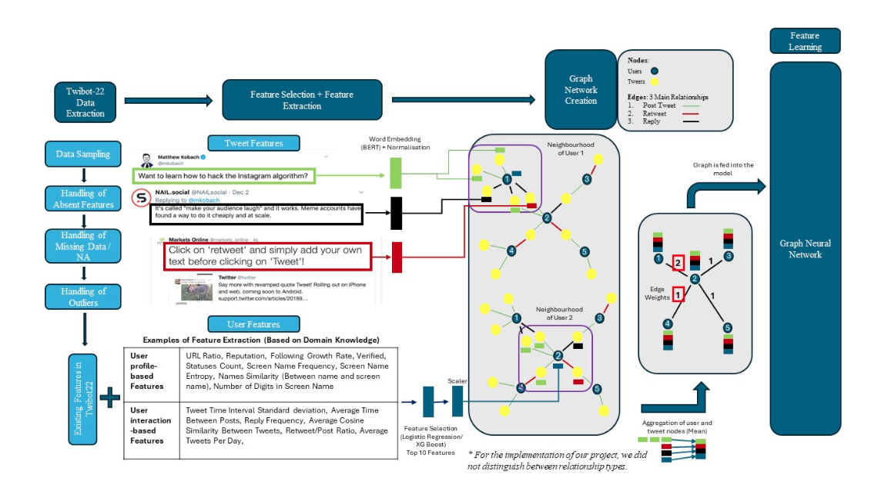
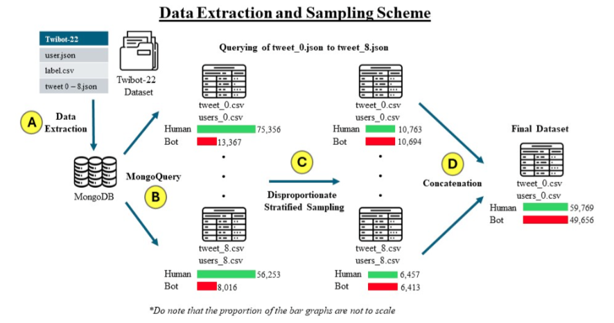
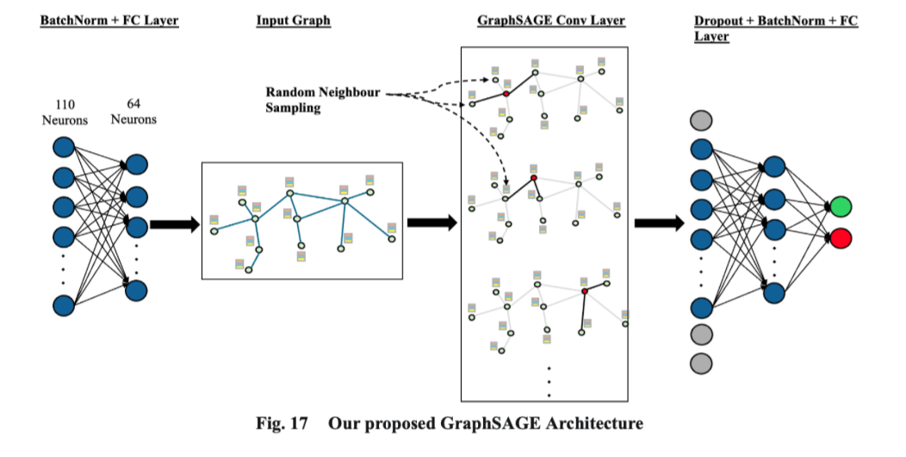

# TwitterBotGNN
Implementation of a Graph Neural Network for Twitter Bot Detection. Unique from existing scholarship, this methodology includes the use of user meta information in the graph network, as well as a distinction of relationships (tweets) between the users and bots. Through the use of different graph aggregation algorithms, we will be able to distinguish between users and bots via node classification. The following presents our overall methodology and model architecture:



## Data Source
The **Twibot-22** dataset that was used in this project can be retrieved from their official [github](https://github.com/LuoUndergradXJTU/TwiBot-22?tab=readme-ov-file) or the [Bot Repository](https://botometer.osome.iu.edu/bot-repository/datasets.html). Do note that special permission must be seek from the creator of this dataset and it can only be used for <ins>academic/research purposes</ins>.


## Disclaimer
Due to the sheer size of the files inside the dataset and limited computational resources on our end, we have employed MongoDB to query the individual datasets to downsample and process the data. The instructions to install MongoDB Compass and query the data is documented in the following section.

## Setting up (For MacOS only)
1. Install MongoDB Compass 
- Navigate to the [download page](https://www.mongodb.com/try/download/compass).
- Choose the version suitable for macOS.
- Click on download button to get the ".dmg" file.

2. Install MongoDB Community Edition using HomeBrew.
```bash
brew tap mongodb/brew
brew install mongodb-community@7.0
```

3. Start MongoDB service using HomeBrew.
```bash
brew services start mongodb-community@7.0
```

4. Connect to it using MongoDB Shell.
```bash
mongosh
```

5. Load all the `tweets.json` from Twibot-22 dataset into a new collection using the GUI.

## Methodology
The following sequence of Jupyter Notebooks serve as the methodology for our research procedure.

1. `Step1_Feature_Engeering.ipynb` (**Run this file to generate `user_0.csv to user_8.csv` and `graph_0.csv to graph_8.csv`**)
- Run this script on each `tweets.json` by querying the data using MongoDB.
- We utilised a disproportionate stratified sampling methodology to obtain a sample of bot and human accounts.
- We engaged in a series of Feature Engineering and Feature Learning steps by incorporating domain knowledge.
The following diagram shows our data engineering scheme:



2. `Step2_Feature_Selection.ipynb` (**Run this file using `user_0.csv to user_8.csv` and `graph_0.csv to graph_8.csv` generated from the previous step**)
- There were a total of 9 tweet files within the dataset containing tweet, retweet and post information between users.
- After sampling from each of those tweet files, and engaging in Feature Engineering, we collated the relevant CSVs and aggregated them in `Feature_Selection.ipynb`.
- In addition to this, we utilised Feature Selection to select useful features (wrt the model) and did Exploratory Data Analysis to come to a concerted decision on whether to retain the features.

3. `Step3_Bot_Clusters.ipynb`
- Group bots into 5 clusters (**save the `bot_clusters_ids.csv`**) and obtained their tweets (**generate a `cluster_<cluster_number>_<tweet_file_number>.txt`**).
**Note**
This `Step3_Bot_Clusters.ipynb` notebook is a script that allows us to get the sampled bots and their tweets from all the 9 different tweet files from Twibot-22 through MongoDB.

4. `Step4_Cluster_TFIDF` (**Uses the output files from `Step3_Bot_Clusters.ipynb`**)
- Combined 9 sets of `cluster_<cluster_number>_<tweet_file_number>.txt` per clusters.
- Retrieves top 30 important words from each bot cluster using TF-IDF and identify the type of bots in each cluster based on topic.

5. `Step5_Model_Training_Evaluation.ipynb` (**Run this file using `users.csv`, `graph.csv`, `label.csv`, `bot_clusters_ids.csv`**)
- After identifying the top 10 useful features, we were able to utilise them in training our models for Baseline GCN, Graphsage and GAT.
- Classical Machine Learning methods were also used to train on the same dataset to allow for a meaningful comparison at the end of the study.
- After training the models, we were able to identify the false negatives (bots misclassified as humans) and we attempted to cluster the bots to decipher the reasons why they were misclassified.
- We also run the model on 3 subset of features: all features, top 10 important features and the other features to observe if feature selection plays a part in the performance of our model.

## Final Proposed GNN


## Files 
The following are the files (primary and intermediary) that will be generated/used in this project.
1. `user_0.csv to user_8.csv`
- The csv contains sampled users and their extracted and original features from the Twibot-22 dataset
2. `graph_0.csv to graph_8.csv`
- The csv contains the source_user_id, target_user_id and the tweet from each of the 9 tweet JSON from the Twibot-22 dataset
3. `users.csv`
- Combined `user_0.csv to user_8.csv` that is used for feature selection and model training
4. `graph.csv`
- Combined `graph_0.csv to graph_8.csv` using aggregation that is used building our graph structure for GNN models
5. `label.csv`
- The label (human or bot) for each user_id
6. `cluster_stopwords.txt`
- A list of common words that should have been stop words but are not included in the library
7. `bot_clusters_ids.csv`
- Matches source_user_id that are bots to their corresponding bot cluster (0 to 4)

## Documentation
View our full project report via our [Google Doc](https://docs.google.com/document/d/1zt3nTqYfuNpeQlkOJrDcbzMdbNPGSWF7EtzbzZ0oeic/edit?usp=sharing).
